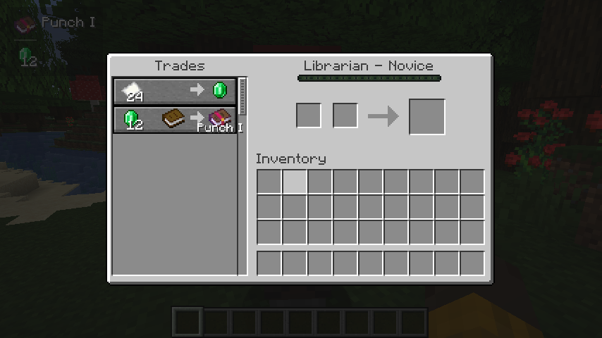
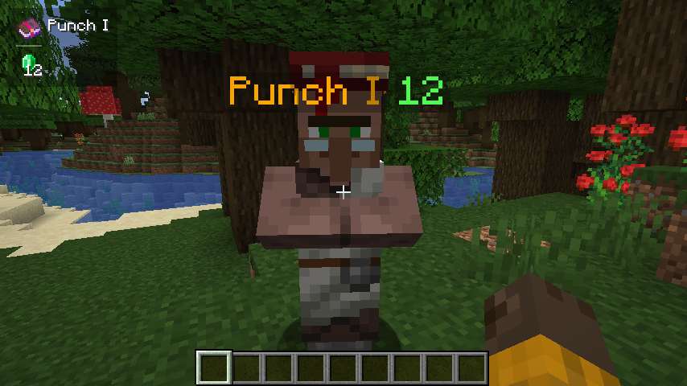

When trading with a villager, it will automatically display its enchantment above the enchantment book or enchanted item, cycling through them in sequence.

When the crosshair is pointed at a tradable villager, attempt to get the trade information and save it. (Or enable the setting **Always attempt to get nearby offers** to automatically get it)

If the trade information is successfully obtained, all enchanting trades will be displayed.

当与村民交易时，会自动在附魔书或者附魔物品上方显示其附魔，按顺序循环切换。

当准星对准可交易的村民时，尝试获取交易信息并保存。(或者启用设置**始终尝试获取附近的交易信息**时自动获取)

若成功获取到交易信息，则显示所有关于附魔的交易。

